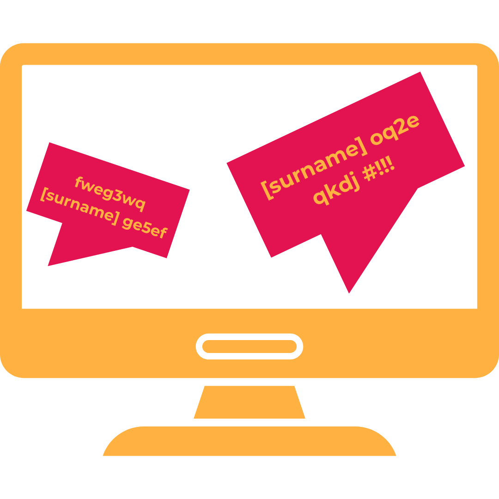

# BANonymizer-PL: A fine-tuned model for anonymizing Polish-language social media content

BANonymizer-PL is a fine-tuned HerBERT-large-cased model trained on a subset of [**BAN-PL**](https://github.com/ZILiAT-NASK/BAN-PL). It specializes in detecting and anonymizing surnames and pseudonyms, grouped into a single class for enhanced accuracy in Polish-language social media content. This tool addresses growing ethical concerns regarding the publication of large-scale social media datasets containing personal information, including the names of public figures ooften targeted by toxic or offensive attacks. Unlike traditional NER-based tools, BANonymizer-PL is optimized to handle the linguistic nuances and spelling variations — both intentional and unintentional — that are prevalent in social media content, making it an invaluable resource for privacy-preserving applications.

It was chosen to merge surnames and pseudonyms into one class to improve the F1 score for the task of masking personal information, while staying in line with the general goal of the model. This decision was driven by the observation that the tested models frequently confused Polish pseudonyms with surnames. Treating these groups as a single label helped mitigate such ambiguities. The model was trained on a dataset of over **20,000 manually labeled samples** and evaluated on a separate test set of more than 2,000 examples. After training, the model exhibited strong performance in identifying sensitive information, achieving high Precision, Recall, and F1-Score, all exceeding **0.8**.

The model is accessible on [**Hugging Face**](https://huggingface.co/NASK-PIB).
